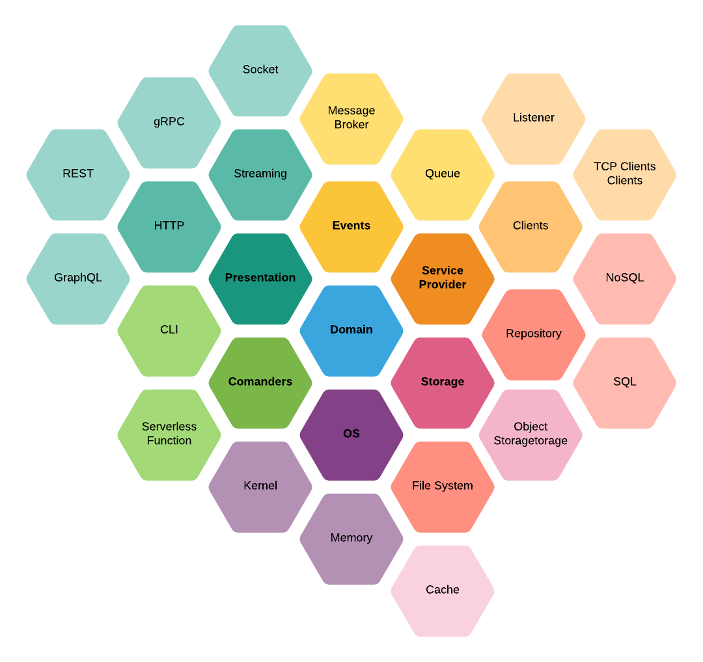

# Hexgonal estructure + CQRS

Esse projeto tem como objetivo servir como base de estrutura hezagonal(port/adapters) com um adicional de CQRS para desacoplar o processo de leitura e escrita do processo de persitência.

